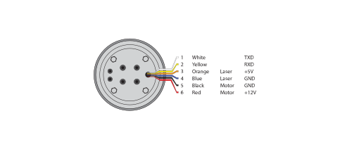
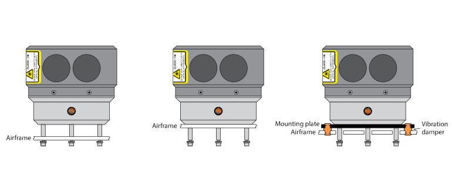
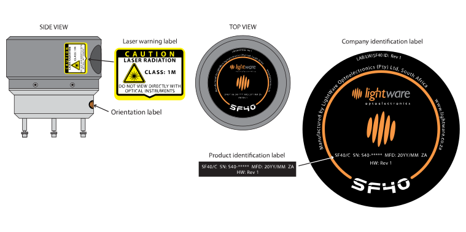

# Hardware

## Connector wiring

The power supply for the board is from 6.5 V to 30.0 V DC, connected to Pins 1 and 2 of the Power connector.

- The power supply current capacity should be at least 1 A
- The typical power consumption with the motor running is 4.5 W
- The current drawn reduces at higher supply voltage to keep an approximately constant power consumption
- The battery voltage reading can be trimmed to compensate for voltage losses down the wires
- There is a low battery system status flag that becomes active when the battery voltage drops below a preset level. This can be read through the serial port or linked to the hardwired alarms
- There is a flat battery system status flag that becomes active when the battery is too flat to drive the motor. This can be read through the serial port or linked to the hardwired alarms
- The motor is turned off when the battery is flat to reduce the current consumption
- The flat battery status flag of the internal status register remains active until it is reset by reading the status register or restarting the motor.

Serial communication, both in HMI and MMI modes, is accessed via the electrically isolated, User connections 7 way header. The
power for the user connector accommodates voltage supply in the range of 2.7 V ... 5.5 V DC and should be connected to pins 6
and 7 of the User connector.

The user connections are via a serial port (logic level) and two hardwired alarm outputs:

- User connections and hardwired alarms are electrically isolated from the rest of the board with an isolation capability of 1000 V DC
- Power for the user interface comes from the user side and can be from 2.7 V to 5.5 V DC
- The hardwired alarm outputs can be linked to any alarm zone or internal status flag as required.

## Mounting on an airframe

## Dimension drawings

## Labeling

