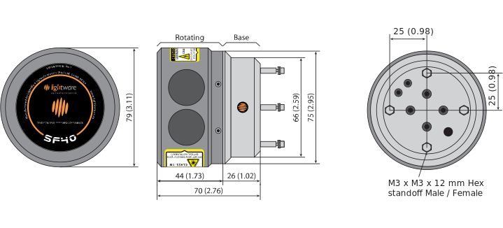

# Hardware

## Connector wiring

**Serial UART (Pins 1 & 2)**

- 3.3 V TTL UART
- Supports baud rates from 115200 to 921600

**Laser power supply (Pins 3 & 4)**

- Power supply should provide 5 V +- 10%
- Power supply current capacity should be at least 0.2 A

**Motor power supply (Pins 5 & 6)**

- Power supply should provide 12 V +- 10%
- Power supply current capacity should be at least 0.5 A

## Mounting on an airframe

## Dimension drawings

## Labeling

