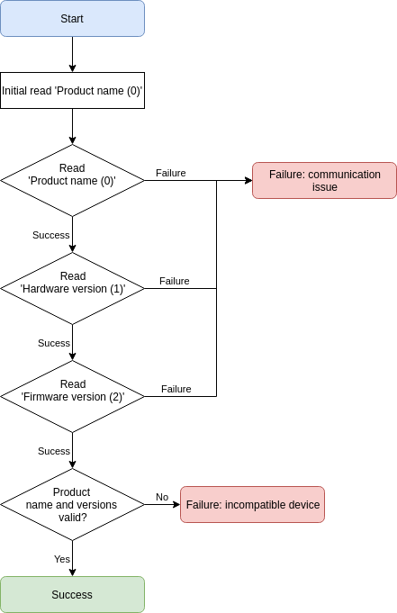

# Initiating connection

This example shows how to establish communication and verify version information.

> Serial interface note: The initial read command is just a read request, there is no need to check for the response. However all subsequent commands should follow the request/response pattern as outlined in [Handling request & response](serial?id=handling-request-amp-response).