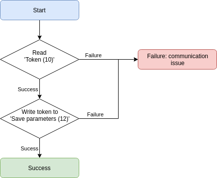

# Saving parameters

The SF40 has parameters that can persist across power cycles. These parameters will only persist once the `Save parameters` command has been issued with the appropriate `token`. See the [Save parameters](command_detail?id=_12-save-parameters) command for more information.

Here is the procedure for getting and using a token for parameter saving:

> A connection should already be initiated as shown in [Initiating connection](initiate.md).

