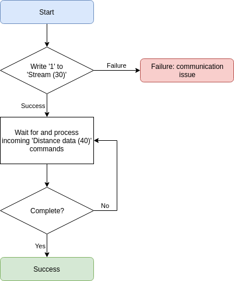

# Streaming data

This example shows how to stream the distance results. See the [stream](command_detail?id=_30-stream) command for more information.

> A connection should already be initiated as shown in [Initiating connection](initiate.md).

